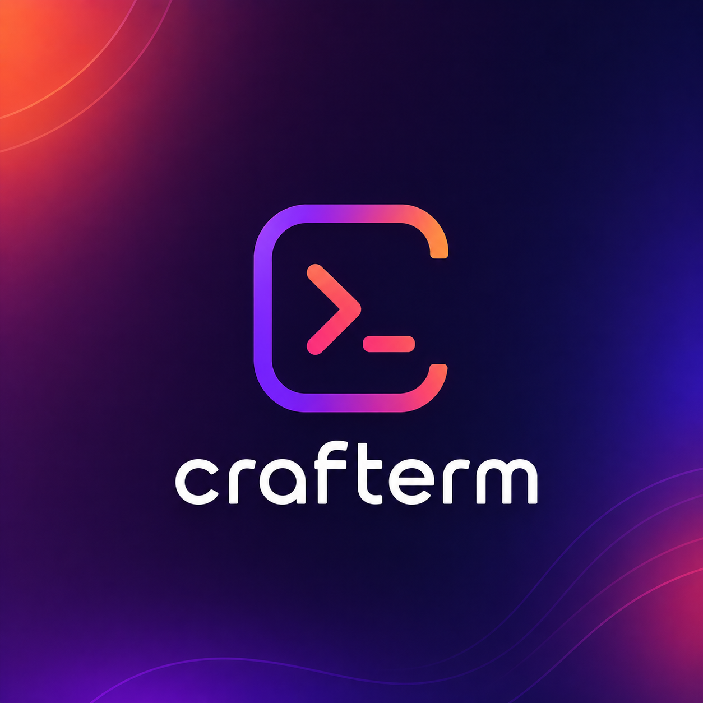

<div align="center">



# Crafterm

**A fully-customizable macOS terminal manager** — split-pane terminals, a
project/folder sidebar, rich pickers, an in-app notebook, and first-class
Claude Code awareness. Built on **Electron + xterm.js + node-pty**; every pane
runs your real `zsh` login shell.

[](LICENSE)


</div>

> Crafterm is built to play nicely with CLI agents like **Claude Code**: when a
> background pane finishes a long run or rings the terminal bell, a native macOS
> notification fires and a card lands in the right-side feed — so you can fan out
> work across many panes and act on each when it's ready. No extra config needed.

---

## Screenshots

_(Add screenshots/GIFs here.)_

---

## Why Crafterm?

A terminal multiplexer (tmux/cmux) that feels like a native macOS app instead of
a config file. You get a visual split tree you can drag to resize, a persistent
project sidebar that survives restarts, and built-in pickers for the things you
actually do all day — switching projects, jumping between git worktrees, resuming
a Claude session, opening an SSH connection. Sessions restore exactly where you
left them, including the working directory and any running Claude session.

---

## Features

### 🖥️ Terminals & splits

- **Real shells.** Each pane is a `zsh` **login shell** spawned through
  `node-pty` (`-l`, `xterm-256color`). Crafterm renders the bytes — it never
  parses or proxies your shell.
- **Split trees.** Every tab is a recursive split tree. Split right (`Cmd+D`) or
  down, nest splits arbitrarily, and **drag the gap** between two panes to
  resize live (sizes persist). `Cmd+Shift+E` distributes panes evenly.
- **Drag to rearrange.** Grab a pane by its header grip and drop it on any
  edge of another pane to re-split or move it.
- **Directional & cyclic focus.** Move focus by geometry (`Cmd+Alt+Arrows`,
  bridging to/from the sidebar at edges) or cycle within a tab (`Cmd+[` / `Cmd+]`).
- **Per-pane appearance.** Independent font zoom (`Cmd +/-/0`, clamped 6–40) and
  a per-pane background color override from a folder-hue palette.
- **Clickable links.** `Cmd+click` a URL to open an **in-app browser split**, a
  `.md` path to open the built-in viewer, or a code file to open it in your `ide`.
- **Pop-out windows.** Detach any terminal pane into its own window; the PTY is
  *adopted*, not restarted, so the running process keeps going. The original spot
  becomes a "open in separate window / focus" placeholder.

### 🗂️ Project / folder sidebar

- **Three node kinds.** Organize sessions into **projects** (bound to a working
  path, with an optional default command and group), **folders** (nested up to 4
  deep), and **tabs** (one terminal session each).
- **Per-container defaults.** Folders and projects can define a startup command,
  a shell override, and environment variables (`KEY=VALUE` lines) applied to
  every terminal opened inside.
- **Full drag & drop.** Reorder, nest, and move any row; depth limits and
  cycle-into-self are enforced. Drop on empty space to move to root.
- **Pin, color, rename.** Pin rows into a top "Pinned" section, tint rows with an
  8-color palette, and inline-rename (double-click). Locked titles can return to
  OSC auto-naming.
- **At-a-glance detail.** Per-row status dot (running / idle / attention) and an
  optional detail line: status text · git branch · pane count (each toggleable).
- **Layout options.** Sidebar on the left (vertical) or top (Chrome-tab style),
  resizable divider, independent sidebar font size, whole-panel collapse (`Cmd+B`).

### 🔭 Pickers & command palette

All pickers use fast case-insensitive substring matching with full keyboard nav
(arrows · `Enter` · `Esc`):

- **Command palette** (`Cmd+Shift+P`) — your live `zsh` aliases & functions plus a
  user cheatsheet, grouped by category. Ships with editable **git** (~15) and
  **linux** (~14) seed commands. *Inserts* into the active terminal for editing.
- **Project picker** (`Cmd+O`) — open a saved project in a new tab (`⏎`) or split
  (`⌘⏎`).
- **Folder picker** (`Cmd+P`) — browse from your code root and open a terminal in
  any directory.
- **Terminal switcher** (`Cmd+Shift+O`) — jump to any open pane across all tabs.
- **Worktree dashboard** — list, open, or remove git worktrees of the active repo.
- **SSH manager** — saved connections (passwords are copy-only, never auto-typed).
- **Command history** — every command Crafterm has seen, newest first, copyable.
- **Plans & markdown finders** — open `~/.claude/plans` or any markdown under your
  configured folders.

### 🤖 Claude Code integration

- **Auto-detection.** When you launch anything whose first program word contains
  "claude", the pane is marked as a Claude pane and its session id is captured.
- **Sessions dashboard** — every live Claude pane, refreshing every second; click
  to jump to it.
- **Resume any session** — browse all historical sessions from `~/.claude` (with a
  summary of the first prompt) and `claude --resume <id>` in a new terminal.
- **Account switcher** — discovers your `claude-switch-*` shell commands and runs
  the chosen one.
- **Restore in place.** Claude panes reopen with `--resume`/`--continue` on app
  restart, landing in the same working directory.

### 🌿 Git & worktrees

- **Live status bar** per pane: branch · worktree · cwd (the **branch is
  clickable** → checkout). cwd is discovered via `lsof` on the PTY — no shell
  config required.
- **Quick git actions** from the pane menu run *in the pane's own terminal* (so
  output stays visible): Pull · Commit + push · Commit + push + PR · Stash · Stashes.
- **Worktrees** — create a new worktree from a form (name + base branch), or
  manage existing ones from the dashboard.
- **Branch & stash pickers** with live filtering.

### 📓 Notebook

- A second sidebar mode (`Cmd+2`) holding a tree of markdown notes under
  `~/.crafterm/notebooks`, with the same tree/drag/rename UX as the terminal
  sidebar.
- Open a note into an editable **doc pane** (preview + editor, `Cmd+S` to save).
- New note (`Cmd+N`), new folder (`Cmd+Shift+N`), reveal in Finder, rename, delete.

### 🔔 Right-side panel

A persistent panel mirroring the left sidebar (`Cmd+Alt+Right` to toggle), with
four tabs:

- **Alerts** — a dismissible feed of every notification (finish / bell /
  attention), tagged with the pane's folder path and a relative timestamp. Click a
  card to jump to its pane. Cards stay until dismissed, so you can leave work
  hanging and act later.
- **Reminders** — create reminders, snooze them, and review past ones.
- **Files** — a file explorer.
- **Time** — time tracking.

### 📣 Smart notifications

- The finish-notification is **armed when you press Enter**, so even fully silent
  long runs qualify. A command running ≥ 3s fires a **"<title> finished"**
  notification on the idle edge — but only when the pane is **unattended**
  (window blurred or another pane active).
- The terminal **bell** raises an `attention` status and a **"<title> is ready"**
  notification.
- Clicking any native notification restores the window and focuses the exact pane
  that fired it.

### 🎨 Theming & appearance

- **7 bundled themes** (GitHub Dark, Dracula, One Dark, Nord, Solarized Dark,
  Tokyo Night, Monokai) plus a **fully custom palette**: background, foreground,
  cursor, selection, and all 16 ANSI colors, each editable with a picker + hex.
- Configurable font family & size; an app/terminal background color that always
  overrides the theme background.

### 📝 Markdown, docs & browser panes

- A **dependency-free markdown renderer** (fenced code, GFM tables, task lists,
  headings, lists, inline formatting) used by note panes and the doc viewer.
- **Doc panes** for editing markdown notes and linked external `.md` files.
- **Browser panes** — an embedded `<webview>` with reload / open-external controls.

### ✅ Improve — built-in todo editor

- Opens your configured `todo-list.md` (`Cmd+Shift+L`) as a structured board:
  In progress / Backlog / Ready to test / Done, with counts and a progress bar.
- Inline edit, mark done, reopen, approve, request a new feature, and
  drag-to-reorder the backlog (file order = work order).

> The complete, exhaustive behavior reference lives in
> [`docs/features.md`](docs/features.md).

---

## Requirements

- macOS
- Node.js 18+ and npm
- Xcode Command Line Tools (`xcode-select --install`) — required to build the
  native `node-pty` module.

## Run (development)

```bash
npm install     # also rebuilds node-pty for Electron's ABI (postinstall)
npm run dev     # launch with hot reload
```

If `node-pty` fails to load, rebuild it for Electron manually:

```bash
npm run rebuild
```

## Build & package

```bash
npm run build       # bundle main + preload + renderer into out/
npm run dist        # electron-builder package (dmg + zip)
npm run dist:dir    # unpacked build (faster, for local testing)
```

`electron-vite build` does **not** typecheck. Typecheck explicitly:

```bash
npx tsc --noEmit -p tsconfig.web.json     # renderer + preload
npx tsc --noEmit -p tsconfig.node.json    # main + preload
```

> The packaged app is currently **unsigned / not notarized**. On first launch
> macOS Gatekeeper may block it — right-click the app → **Open**, then confirm.

---

## Keyboard shortcuts (macOS)

Defaults below; all of these are **rebindable** in Settings → Shortcuts.

| Key             | Action                              |
| --------------- | ----------------------------------- |
| `Cmd + T`       | New terminal                        |
| `Cmd + Shift+T` | New Claude terminal                 |
| `Cmd + O`       | Project picker (markdown finder in Notebook) |
| `Cmd + Shift+O` | Terminal switcher                   |
| `Cmd + P`       | Folder picker                       |
| `Cmd + Shift+P` | Command palette                     |
| `Cmd + Shift+F` | Focus search                        |
| `Cmd + B`       | Toggle sidebar                      |
| `Cmd + Shift+N` | New folder                          |
| `Cmd + D`       | Split pane (right)                  |
| `Cmd + Shift+D` | Split pane with Claude              |
| `Cmd + [` / `]` | Previous / next pane in tab         |
| `Cmd + Shift+E` | Distribute panes evenly             |
| `Cmd + Shift+R` | Rename selected item                |
| `Cmd + Shift+L` | Improve Crafterm (todo editor)      |
| `Cmd + ,`       | Open Settings                       |

Fixed (not rebindable):

| Key                | Action                                         |
| ------------------ | ---------------------------------------------- |
| `Cmd + W`          | Close active pane                              |
| `Cmd + Alt+←` / `→`| Toggle sidebar / notification panel            |
| `Cmd + Alt+Arrows` | Focus pane in direction                        |
| `Cmd + =`/`-`/`0`  | Zoom in / out / reset (doc, sidebar, or terminal) |
| `Cmd + 1` / `2`    | Terminal mode / Notebook mode                  |
| `Cmd + 1..9`       | Jump to row N in the sidebar                   |
| `Cmd + S`          | Save the active doc (while editing)            |

---

## Architecture

```
   RENDERER (Chromium / web)          MAIN (Node.js)              OS
   ┌───────────────────────┐      ┌──────────────────┐
   │ xterm.js (draws)      │      │ node-pty         │
   │  keypress  ───────────┼─IPC─>│ pty.write() ─────┼──> zsh
   │  screen    <──────────┼─IPC──┤ pty.onData() <───┼─── zsh output
   └───────────────────────┘      └──────────────────┘
```

- **Main** (`src/main/index.ts`) owns node-pty processes, windows, native
  notifications, the app menu, and every IPC handler. Anything that touches the
  OS lives here.
- **Preload** (`src/preload/`) exposes a narrow, typed `contextBridge`
  (`window.crafterm`) — the only channel between renderer and shell.
- **Renderer** (`src/renderer/src/`) is vanilla TS + DOM (no UI framework),
  using a manager/hooks pattern with a single source of truth in `state.ts`.

### Renderer modules (`src/renderer/src/`)

| File | Responsibility |
| ---- | -------------- |
| `state.ts` | Central state, settings, persistence, render-hook dispatch |
| `types.ts` | Shared types (layout tree, sidebar tree, pane, settings) |
| `main.ts` | Boot, wiring, keyboard shortcuts |
| `commands.ts` | High-level actions (new/split/close, move, color, pin, rename …) |
| `pane.ts` | Pane/terminal lifecycle: create, status, title, bell, info |
| `content.ts` | Renders the terminal area (splits + drag resizers) |
| `sidebar.ts` | Sidebar: folders/projects, drag-drop, context menu, rename, color, pin |
| `notebook.ts` | Notebook tree + linked external files |
| `notifications.ts` / `reminders.ts` / `explorer.ts` / `time.ts` | Right-panel tabs |
| `pickers.ts` | Modal pickers (command palette, project, worktree, SSH, Claude, finders) |
| `settings.ts` | Settings modal |
| `themes.ts` / `markdown.ts` / `tree.ts` / `dialog.ts` / `popout.ts` | Theming, markdown, pure tree algorithms, modal helpers, pop-out |

---

## Persistence

App state is stored as pretty-printed JSON under `~/.crafterm/` (dev:
`~/.crafterm-dev/`), including notebooks. Saved sessions restore their working
directory, locked title, Claude session, and background color in place. Nothing
leaves your machine.

## Themes

Bundled themes live in `src/renderer/src/themes.ts`; paste more from
[iTerm2-Color-Schemes](https://github.com/mbadolato/iTerm2-Color-Schemes) (the
`xterm/` folder is already in xterm.js format).

---

## Contributing

Contributions are welcome — see [CONTRIBUTING.md](CONTRIBUTING.md). By
participating you agree to the [Code of Conduct](CODE_OF_CONDUCT.md). Security
issues: please follow [SECURITY.md](SECURITY.md).

## License

[MIT](LICENSE) © Akin Gundogdu
